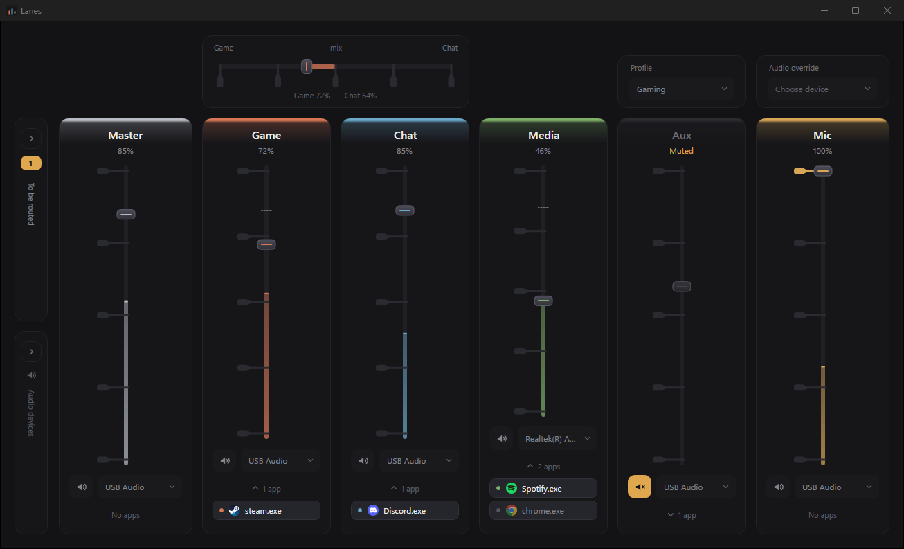
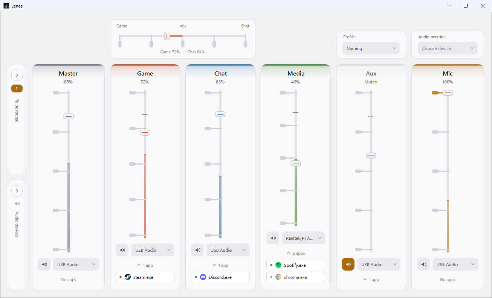
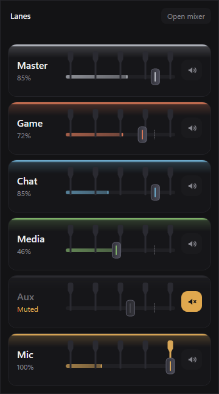
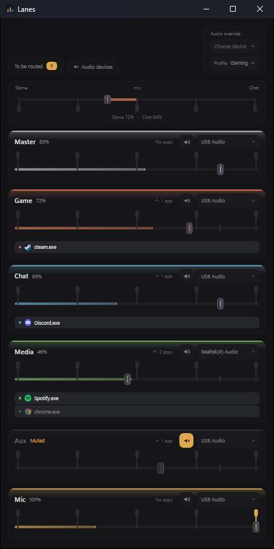

<p align="center"></p>

<h1 align="center">Lanes</h1>

<p align="center"><b>Per-application audio channels for Windows.</b><br>
Group your apps into channels - Game, Chat, Media and more - each with its own
volume, mute and output device, all from one window.</p>

<p align="center"></p>

---

Game and voice chat in your headset while a video plays through the speakers,
each at its own level, controlled from one mixer - with **no added latency**,
because Lanes never touches the audio itself.

## What it does

- **Channels.** Master, Game, Chat, Media, Aux and Mic out of the box, plus one
  of your own. Each has a volume, a mute and an output device.
- **Rules.** Drag an app into a channel once; Lanes remembers it by name and puts
  it back every time it plays, across restarts and reboots.
- **Per-channel output devices.** Send Game and Chat to your headset and Media to
  your speakers at the same time.
- **Master is Windows' own volume.** Moving Master moves the taskbar volume
  slider, and the other way round. It also acts as a ceiling: channels move with
  it without losing their own settings.
- **Game/Chat mix.** One slider that trades game audio against voice chat.
- **Device fallback.** When a headset or DAC is unplugged, its channels move to
  the next device in your priority list, show amber, and move back when it
  returns.
- **Profiles**, **global hotkeys**, a **quick mixer** from the tray, per-app
  **trim**, an **ignore list**, **light and dark** themes, and a notice when an
  app you have not assigned starts playing (turn it off with one click).
- **A local API** on `127.0.0.1` that anything can use - the mixer window does,
  and so does the [Stream Deck plugin](https://github.com/MAYBE-33/lanes-streamdeck).
- **Restore.** One button puts Windows audio back exactly as it was before Lanes.

## A closer look

<table>
<tr>
<td width="50%"></td>
<td width="22%"></td>
<td width="28%"></td>
</tr>
<tr>
<td><b>Light or dark</b>, following Windows unless you choose. Every channel shows its level, its device and its apps; the amber <b>1</b> on the left is an app playing outside any channel.</td>
<td><b>The quick mixer</b>, from a click on the tray icon: every fader and mute, nothing else.</td>
<td><b>Any window size.</b> Narrow or portrait windows turn the channels into rows, and the whole mixer scales to fit rather than scroll.</td>
</tr>
</table>

<sub>Screenshots show example channels, apps and devices.</sub>

## How it works, and what it deliberately does not do

Lanes is not an audio mixer. It manages the settings Windows already has for
every application - its volume, its mute, and its output device - and gives
them a proper mixer. The audio goes from each app to Windows to your hardware
exactly as it always did.

That is why there is **no virtual audio device, no driver, no added latency,
no lip-sync drift, and no administrator rights** needed at any point. It is also
why Lanes has **no EQ, effects or audio processing**, and cannot record or mix
streams. See [limitations](docs/limitations.md) for what that rules out.

## Install

Download the installer from **[Releases](https://github.com/MAYBE-33/lanes/releases)**
and run it. Windows 10 (1809) or later, 64-bit. Nothing else to install. Full
instructions, including the SmartScreen warning: [docs/install.md](docs/install.md).

Then: every app that plays sound appears in **"To be routed"**. Drag it onto a
channel. That's it.

## Before you uninstall

Windows stores each app's volume and output device itself, so the changes Lanes
makes **outlive Lanes**. To put everything back, use **tray menu > Settings >
Restore Windows audio settings** (or `Lanes.exe --restore`) *before*
uninstalling. [Details](docs/install.md#uninstalling).

## Privacy

Lanes makes **no network connections** - no telemetry, no update check. Its API
listens on `127.0.0.1` only and refuses web pages. Everything it stores stays in
`%LOCALAPPDATA%\Lanes`. The microphone meter reads a level and discards the
audio.

## Documentation

| | |
| --- | --- |
| [install.md](docs/install.md) | Installing, using, uninstalling, portable mode |
| [troubleshooting.md](docs/troubleshooting.md) | When something is not right |
| [configuration.md](docs/configuration.md) | Every field of `config.json` |
| [api.md](docs/api.md) | The local API: every command and state field |
| [architecture.md](docs/architecture.md) | How the core, window and API fit together, and why |
| [window.md](docs/window.md) | How the window is built |
| [interop.md](docs/interop.md) | The two undocumented Windows interfaces Lanes depends on |
| [building.md](docs/building.md) | Building from source, and making your own version |
| [limitations.md](docs/limitations.md) | What Lanes 1.0 does not do |
| [code-signing.md](docs/code-signing.md) | How releases are signed |

## Building

Rust, the MSVC build tools and the .NET 10 SDK, then:

```powershell
powershell -ExecutionPolicy Bypass -File tools\build-release.ps1
```

See [building.md](docs/building.md).

## Licence

Lanes is free software: you can redistribute it and/or modify it under the
terms of the **GNU General Public License, version 3 or later**. See
[LICENSE](LICENSE). It is distributed in the hope that it will be useful, but
without any warranty.

Lanes is built with open-source components listed in
[THIRD-PARTY-NOTICES.md](THIRD-PARTY-NOTICES.md). Per-application routing
without a driver is possible because of the work of the
[EarTrumpet](https://github.com/File-New-Project/EarTrumpet) authors in
describing Windows' undocumented audio policy interface.
